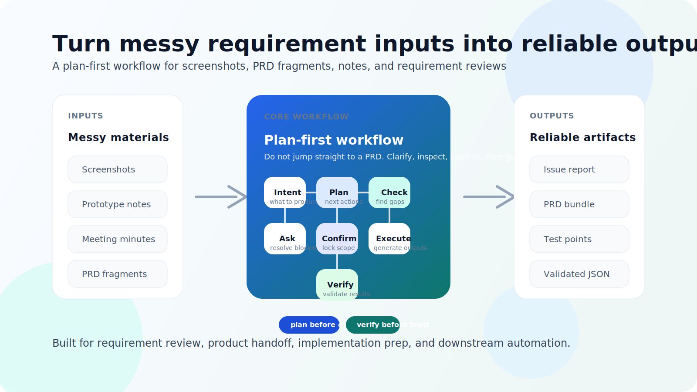

# requirement-assistant

[中文](README.md) | [English](README_EN.md)

[](https://www.npmjs.com/package/@chaidd/requirement-assistant-skill)




把截图、原型、会议纪要、PRD 片段这些混乱的需求材料，整理成可执行、可校验、可复用的结构化需求产物。

这不是一个“直接帮你生成一篇 PRD”的普通 prompt 集合，而是一套更适合团队落地的 **plan-first 需求工程流程**：

- 先理解目标和范围
- 先产出执行计划
- 先检查缺失、歧义、冲突和覆盖缺口
- 再整理待确认项并设置确认闸门
- 最后才生成 PRD、功能清单、测试点或严格 JSON

它既适合在 GPT / Codex 里作为 skill 使用，也适合被下游自动化流程消费，因为仓库同时提供了：

- 明确的需求分析流程
- 三类严格 JSON Schema
- 最小合法样例
- 本地 bootstrap / validate 工具
- eval 基线

> 如果你也不想再让 AI 直接从几张截图“脑补出一篇看起来很完整、但细节并不可靠的 PRD”，这个项目就是为你准备的。

安装说明见 [INSTALL.md](INSTALL.md)。

---

## 输入材料 -> 输出结果

下面是一个更接近真实使用场景的示例。

### 输入材料

假设你手上只有这些零散信息：

- 2 张“会员中心”页面截图
- 一段会议纪要：`会员等级到期前 7 天提醒；过期后权益失效，但历史订单不受影响`
- 一段产品说明：`会员页需要展示当前等级、到期时间、续费入口、权益说明`
- 一句口头补充：`续费入口暂不支持企业会员`

这些信息看起来已经不少了，但如果直接让 AI 写 PRD，通常会出现几个问题：

- 默认脑补了未确认的业务规则
- 没有把“个人会员”和“企业会员”差异单独拎出来
- 忽略到期前、到期后、续费失败等关键状态
- 没有指出哪些地方仍然需要确认

### 输出结果

`requirement-assistant` 更推荐先产出一个 `issue-report` 或执行计划，结果会更像这样：

```yaml
意图摘要:
  目标产物: issue-report
  分析范围: 会员中心会员模块
  当前目标: 在生成 PRD 前先识别需求缺口

已识别内容:
  - 展示当前会员等级
  - 展示到期时间
  - 提供续费入口
  - 展示会员权益说明
  - 到期前 7 天提醒
  - 到期后权益失效
  - 历史订单不受影响
  - 企业会员暂不支持续费入口

发现的问题:
  缺失项:
    - 未说明提醒通过什么渠道触达
    - 未说明续费失败时的处理方式
    - 未完整定义会员过期后的页面状态
  歧义项:
    - 企业会员是完全不展示续费入口，还是展示置灰按钮并说明原因
    - 会员过期后，是否仍可在当前页面直接续费
  覆盖缺口:
    - 未说明提醒频次规则
    - 未说明过期后会员权益说明的展示方式

必须确认:
  - 企业会员应该隐藏续费按钮，还是展示不可点击按钮并附带说明？
  - 会员过期后，页面应优先展示续费引导，还是优先展示权益失效提示？

建议下一步:
  - 先确认以上 2 个阻塞问题
  - 再生成 prd-bundle 和测试点
```

### 这段输出真正有价值的地方

它不是急着“写一篇看起来完整的 PRD”，而是先把这些事情做对：

- 把已识别事实和待确认问题分开
- 把真正影响实现和测试的问题提前暴露出来
- 把后续该继续问什么、该生成什么交付物说明白

对团队来说，这种输出通常比一篇直接生成的长文档更可靠，也更容易继续往下推进。

---

## 为什么这个项目值得关注

大多数“AI 需求整理”方案有三个共性问题：

- 一上来就直接生成长文档，跳过澄清和确认
- 输出看起来完整，但很难判断哪里是事实、哪里是猜测
- 很难进入团队流程，无法做结构化校验，也无法给自动化系统稳定消费

`requirement-assistant` 的设计目标正好相反：

### 1) 先计划，再生成

它默认不是“直接写 PRD”，而是先做 `intent -> plan -> check -> ask -> confirm -> execute -> verify`。

这会显著降低两类常见风险：

- 需求材料不完整时，AI 直接脑补
- 需求边界没锁定时，产物越写越偏

### 2) 不只生成，还会先找问题

在真正生成交付物之前，它会优先识别：

- 缺失项
- 冲突项
- 歧义项
- 覆盖缺口

这让它更像一个“需求分析助手”，而不是“文档续写器”。

### 3) 适合团队和流程，而不只是单次对话

仓库内置了严格输出 Schema、最小样例、校验脚本和 eval 基线，方便你把结果：

- 交给 GPT / Codex 继续处理
- 接到自动化 pipeline
- 用于需求评审、测试设计、实现前检查

### 4) 能处理真实世界里的混合材料

现实里的需求输入通常不是一份完整 PRD，而是这些混合体：

- 页面截图 / 原型图
- 页面说明 / 字段说明
- 会议纪要 / 讨论记录
- PRD 片段 / 零散规则
- 中英文混合文本

这个项目的目标，就是把这些“碎的、乱的、半成品的输入”，整理成团队能继续推进的结构化结果。

---

## 适合什么场景

你可能会在这些场景里真正感受到它的价值：

- 产品经理拿着一批截图和零散说明，想先查缺失和歧义
- 开发在动手前，想把业务规则、状态流转和边界条件拆清楚
- 测试想快速补出测试点、异常路径和覆盖缺口
- 团队希望把需求分析结果沉淀成结构化资产，而不是散落在聊天记录里
- 你想把“需求理解”这一步纳入自动化链路，而不是只靠人工反复同步

---

## 它到底能产出什么

### 1) `issue-report`

适合在需求还没完全清楚时先做问题扫描。

你会得到：

- 缺失信息
- 冲突点
- 歧义点
- 覆盖缺口
- 待确认项

适合用途：

- 需求评审前预检
- PRD 质量扫描
- 截图 / 原型补全分析

### 2) `prd-bundle`

适合在范围基本确认后，生成更偏交付物的结果。

你会得到：

- PRD 草稿
- 功能点清单
- 测试点
- 用例草稿

适合用途：

- 从需求材料快速整理成执行文档
- 给产品、开发、测试做对齐底稿

### 3) `requirement-package`

适合要做全量沉淀或对接自动化系统时使用。

你会得到：

- 识别摘要
- 结构化模型
- 问题清单
- 待确认项
- 可选生成产物

适合用途：

- 进入下游 AI / 自动化流程
- 做需求资产归档

---

## 仓库结构

```text
SKILL.md                 # skill 主入口与行为规则
schemas/                 # 严格 JSON Schema
examples/                # 最小合法样例
references/              # 模板、检查清单、输出参考
scripts/                 # bootstrap / validate / eval 工具
evals/                   # eval 基线
ra.ps1                   # Windows PowerShell 统一入口
```

---

## 快速开始

### 环境要求

- PowerShell
- Python 3（命令为 `python`）

### 方式 1：直接从仓库使用

如果你已经 clone 了这个仓库，在根目录运行：

```powershell
.\ra.ps1 check-examples
.\ra.ps1 run-evals
```

如果输出正常，说明最小样例和 eval 基线都通过了。

### 方式 2：通过 npm / npx 安装

```powershell
npx @chaidd/requirement-assistant-skill@latest install
```

默认安装到：

```text
%USERPROFILE%\.codex\skills\requirement-assistant
```

安装到当前项目：

```powershell
npx @chaidd/requirement-assistant-skill@latest install --target project
```

安装到指定目录：

```powershell
npx @chaidd/requirement-assistant-skill@latest install --dir C:\Users\you\.codex\skills
```

安装说明详见 [INSTALL.md](INSTALL.md)。

---

## 最常用的几条命令

### 校验仓库自带最小样例

```powershell
.\ra.ps1 check-examples
```

期望输出：

- `VALID` x3

### 生成一个空骨架 JSON

```powershell
.\ra.ps1 bootstrap issue-report out.issue-report.json
```

### 校验一个 JSON 输出

```powershell
.\ra.ps1 validate issue-report out.issue-report.json
```

### 运行 eval 基线

```powershell
.\ra.ps1 run-evals
```

只跑单个样例：

```powershell
.\ra.ps1 run-evals issue-report-gdyd-202603
```

运行失败型基线：

```powershell
python scripts/run_evals.py --manifest evals/negative.json
```

---

## Schema 选择指南

你想做什么，可以直接这样选：

- “我想先找问题、补全需求、扫描风险” -> `issue-report`
- “我想生成 PRD、功能点、测试点、用例草稿” -> `prd-bundle`
- “我想把识别、问题、确认项、产物全部打包” -> `requirement-package`

---

## 作为 Skill 怎么用

这是一个 **plan-first** 的需求工作流 skill。正常情况下，你不需要手动逐阶段输入命令，而是直接用自然语言描述目标，由助手内部按阶段顺序推进。

推荐使用方式：

- `assistant-action，先生成计划并告诉我当前判断，等我确认后再继续`
- `帮我根据这批截图先分析需求，并给执行计划`
- `先检查这份 PRD 有没有歧义、冲突和遗漏`
- `帮我拆这个页面的功能点、状态和流程`
- `这些范围已经确认了，直接输出功能清单和测试点`
- `如果有必须确认项先问我，不要直接生成 PRD`

默认内部流程：

`intent -> plan -> check -> ask -> confirm -> execute -> verify -> finalize`

推荐统一入口：

- `assistant-action`

它会优先输出：

- intent summary
- execution plan
- 当前判断
- 输入清单
- 识别结果
- 分层待确认项
- 下一步建议

更完整的 skill 行为规则见 [SKILL.md](SKILL.md)。

---

## 当前支持

### 输入材料

- 页面截图 / 原型图 / 交互截图
- 页面说明 / 字段说明 / 流程描述
- PRD 片段 / 会议纪要 / 零散需求文本
- 图文混合材料
- 中英混合输入

### 输出产物

- `issue-report`
- `prd-bundle`
- `requirement-package`

### 校验能力

- 对上述三类 JSON 输出做本地校验

---

## 限制与边界

这个仓库很强调“需求分析流程 + 结构化输出”，但它不是一个完整产品。

当前不内置：

- OpenAI API 调用
- Web UI / 服务端
- 截图解析器
- 需求知识库或持久化存储

另外：

- `scripts/validate_output.py` 实现的是 **JSON Schema 子集校验器**
- 它覆盖常用的 `type / enum / required / items / $ref` 等能力
- 但它不是完整的 Draft 2020-12 实现

---

## 适合谁

如果你属于下面任意一种角色，这个项目大概率会对你有价值：

- 想把“AI 需求分析”做得更稳、更可复用的产品经理
- 想在实现前把规则、边界和状态流整理清楚的开发者
- 想让测试点和异常路径更早暴露的测试工程师
- 想把需求分析沉淀成结构化资产的团队负责人
- 想把需求理解结果接到自动化系统里的 AI 工程师

如果这个方向和你正在做的事情一致，欢迎点个 Star。

---

## License

见 [LICENSE](LICENSE)。
